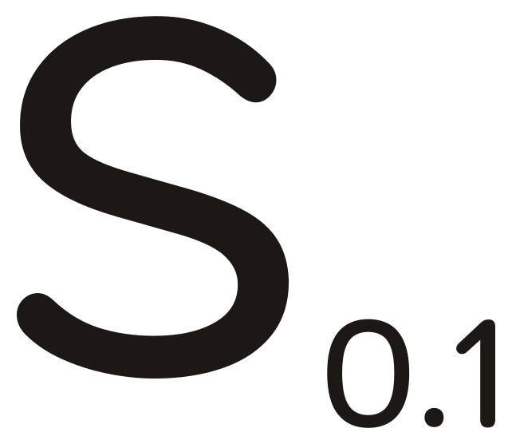
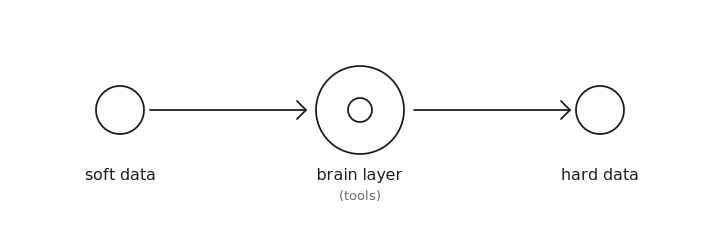

<div align="center">
  <picture>
    <source media="(prefers-color-scheme: dark)" srcset="logo/scelo-dark.svg" />
    
  </picture>

# Scelo

**Soft data → Tools → Hard data.**

A desktop workbench for actuaries who want AI-assisted analysis
without sending client data to a cloud.

</div>

---

## What Scelo is

The mark says what the system is: three nodes on one axis.

| | What |
|:---:|---|
| **Soft data** | What you cannot easily see or decide on. Raw inputs, fuzzy signals, uncommitted material. |
| **Tools / brain layer** | The statistical and actuarial models that focus soft into hard. The audit trail lives here. |
| **Hard data** | Board-pack-ready numbers — defensible, reproducible, traceable. |

The pipeline is one-way: soft never writes to hard directly, hard
never reads from soft. The tools layer is the only path between them.

## What's in this repository

| Path | What |
|---|---|
| [`apps/scelo-ide/`](apps/scelo-ide/) | The Electron desktop wrapper. Bundles Python 3.13 + R 4.3 + Pyright + R-LSP + ripgrep + git plumbing. Owns OS-touching surfaces (file I/O, exec, terminal, dataset downloads, OS keychain, auto-update). |
| [`apps/web/`](apps/web/) | The React + Vite renderer. Workspace shell (Monaco editor + file tree + xterm terminal + sidebar panels: files, search, outline, git, problems, tests), the Scelo brain layer (soft → tools → hard workstations), the workspace AI panel, the welcome view, the swarm route. |
| [`LICENSE`](LICENSE) | Scelo IDE Source-Available License v1.0. See [License](#license). |
| [`CONTRIBUTING.md`](CONTRIBUTING.md) | How to file bugs, propose changes, set up locally, the commit / PR conventions. |
| [`SECURITY.md`](SECURITY.md) | Responsible-disclosure policy. |
| [`ONBOARDING.md`](ONBOARDING.md) | Architecture tour — the apps/web ↔ apps/scelo-ide IPC contract, the bus pattern, migrations, sample workspaces, house rules. |
| [`logo/`](logo/) | The Scelo mark as a standalone SVG and a React component. |

## Quick start

Prerequisites: [Bun](https://bun.sh) ≥ 1.1.

```bash
git clone git@github.com:intelligentactuaries/scelo.git
cd scelo
bun install

# Renderer dev server (browser preview at localhost:5173)
bun run dev:web

# Full Electron IDE — builds main + launches Electron
bun run dev
```

To produce a signed installer for your platform see the
[CONTRIBUTING.md](CONTRIBUTING.md) build section.

## Reporting bugs, concerns, issues

Three channels, all read by the maintainers:

- 🐛 **[GitHub Issues](https://github.com/intelligentactuaries/scelo/issues)** — the public default once the repo flips to open.
- 📬 **bugs@scelo.ai** — for reports you'd rather keep off the public tracker.
- 📬 **scelo@scelo.ai** + **scelo@intelligentactuaries.com** — general concerns, ethical worries, anything that isn't a clean bug.

For **security vulnerabilities**, please use the disclosure flow in
[`SECURITY.md`](SECURITY.md) (not the public tracker).

## Status

> *Active development. Pre-1.0. No public binaries yet.*

The Scelo IDE is in the polish phase of its v1 cycle. The core is
complete:

- Bundled Python 3.13 + R 4.3 + Pyright + R-LSP + ripgrep + git
- Monaco editor with file tree, terminal, search, source control,
  problems panel, tests panel
- Workspace-scoped AI panel (Ollama default; BYO Claude / OpenAI /
  Gemini / OpenAI-compat key in the OS keychain)
- Soft → tools → hard pipeline as the canonical model view, with
  three scoped chatbots and a Hard Data workstation that ties out
  to the swarm-council (256-agent council + 1000-agent society)
- Sample workspace scaffolds (`life-pricing`, `climate-risk`,
  `scelo-brain`, `reserving`) you can spin up in one click
- Data-aware viewers for CSV, Markdown, and Jupyter notebooks
- Per-workspace session persistence: nothing clears unless you ask

What remains before v1:

- [ ] Real signing certificates (Apple Developer + Windows EV) — paid
      prerequisites. Until they're in place, installer artefacts ship
      unsigned and Gatekeeper / SmartScreen warn on first launch.
- [ ] First public release notes + signed installer artefacts on the
      *Releases* tab.
- [x] Flip this repository from private to public. (done 2026-05-26)

## Concepts

### The pipeline

<div align="center">
  <picture>
    <source media="(prefers-color-scheme: dark)" srcset="logo/pipeline-dark.svg" />
    
  </picture>
</div>

One-way edges only. Soft never writes to hard directly; hard never
reads from soft. The tools layer is where the audit trail lives.

### Nanoeconomics carve-out

Anyone using Scelo for **nanoeconomics-for-poverty-eradication** work,
based on the published Nanoeconomics Methodology, can use it free of
charge with no revenue cap. Conditions and the annual-report
mechanics are in [LICENSE](LICENSE) §3. Submissions go to both:

```
scelo@intelligentactuaries.com
nanoeconomics@scelo.ai
```

## License

[Scelo IDE Source-Available License v1.0](LICENSE).

In short:

| Who you are | What you owe |
|---|---|
| Anyone with worldwide Gross Revenue under **ZAR 1,000,000** per year | Nothing. Free for any use, including commercial. |
| Anyone above that threshold | A [Commercial License](mailto:legal@intelligentactuaries.com), unless the use qualifies under the Nanoeconomics carve-out below. |
| Anyone applying the published Nanoeconomics Methodology to **poverty-eradication work** | Free regardless of revenue, conditional on a public annual report submitted to both `scelo@intelligentactuaries.com` and `nanoeconomics@scelo.ai`. |
| Anyone who tries to dodge either of the above | Auto-termination + retroactive back-charge at the standard commercial rate + legal costs. |

The license is global. The Licensor is incorporated in the Republic
of South Africa, contract is governed by South African law, but
disputes default to ICC arbitration and the Licensor can enforce IP
rights in any competent court worldwide. Read the full text — it
covers attribution, prohibited acts, the abuse remedy, warranty
disclaimer, liability cap, and consumer-protection carve-outs.

⚠️ **Not legal advice.** Before relying on this license, consult
counsel in your jurisdiction.

## Contact

| Topic | Where |
|---|---|
| Bugs | **bugs@scelo.ai** · [GitHub Issues](https://github.com/intelligentactuaries/scelo/issues) |
| Security vulnerabilities | **security@intelligentactuaries.com** · see [`SECURITY.md`](SECURITY.md) |
| General Scelo | **scelo@intelligentactuaries.com** · **scelo@scelo.ai** |
| Commercial licensing | **legal@intelligentactuaries.com** |
| Nanoeconomics Annual Report | **scelo@intelligentactuaries.com** **and** **nanoeconomics@scelo.ai** |
| Lab | **hello@intelligentactuaries.com** · [intelligentactuaries.com](https://intelligentactuaries.com) |

---

<sub>Scelo is a project of [Intelligent Actuaries (Pty) Ltd](https://intelligentactuaries.com).
Public methodology, private mandate.</sub>
