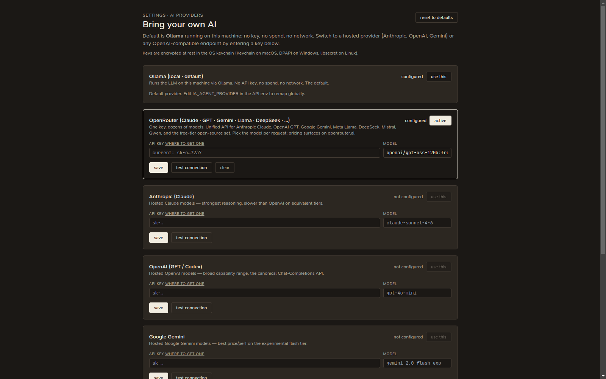

# AI providers

Scelo's AI features (the scoped chats, model suggestions, narratives) run
against an LLM provider. The default is **local and private**; hosted providers
are opt-in.

## Ollama (default — local, private)

By default Scelo talks to **Ollama** running on your machine: **no key, no
spend, no network**. Your data never leaves the device. The default model is
`qwen2.5:7b-instruct`.

## Claude Code (your Claude login — no key)

If you already use [Claude Code](https://claude.com/claude-code) (the CLI), Scelo
can borrow that login: select **Claude Code** in Settings → AI providers and
Scelo answers by shelling out to the `claude` CLI already installed and
signed in on your machine. **No API key, no extra spend beyond your Claude
plan** — you get Claude-grade reasoning without pasting a key anywhere.

- **Desktop app only.** It needs the `claude` executable on your `PATH`
  (install Claude Code and run `claude` once to sign in). In a plain browser
  tab there's no CLI to call.
- **Model.** Leave the model blank to inherit whatever your Claude Code uses
  by default, or set an alias (`opus` / `sonnet` / `haiku`) to pin one.
- **Test connection** works here too, even though there's no key to enter.

## Hosted providers

{ .shadow }

Switch to a hosted provider in **Settings → AI providers** ("Bring your own
AI"):

- **Anthropic** (Claude)
- **OpenAI**
- **Google Gemini**
- **OpenRouter** (one key, dozens of models)
- Any **OpenAI-compatible** endpoint (set a base URL)

For each, set your **API key**, optionally a **model**, and (for compatible
endpoints) a **base URL**. Re-saving with a blank field keeps your previous
value, so you can update just the key without resetting the model.

### Test connection

Each provider has a **test connection** button. It sends a tiny prompt and shows
the reply, so you can confirm the key and model work before relying on them.

!!! note "Reasoning models can return empty"
    Some models (e.g. `gpt-oss`, DeepSeek R1) spend their token budget
    "thinking" before producing visible text. Scelo gives the test a generous
    budget and falls back to the reasoning channel, but if you see
    "(connected — model returned no text)", the connection is fine — the model
    just needs more tokens or you can pick a non-reasoning model.

### Reset

**reset to defaults** clears every saved key/model and switches back to the
local Ollama default. Otherwise your settings persist across launches (keys are
held in the OS keychain where available).

## How it works in the desktop app

The desktop IDE ships no cloud backend. Chat and the "test connection" call the
provider's HTTP API **directly from the app's main process** (no CORS, the
decrypted key never touches the renderer). Replies fill in at once rather than
streaming.

See also [Chat](chat.md) for where these assistants appear.
