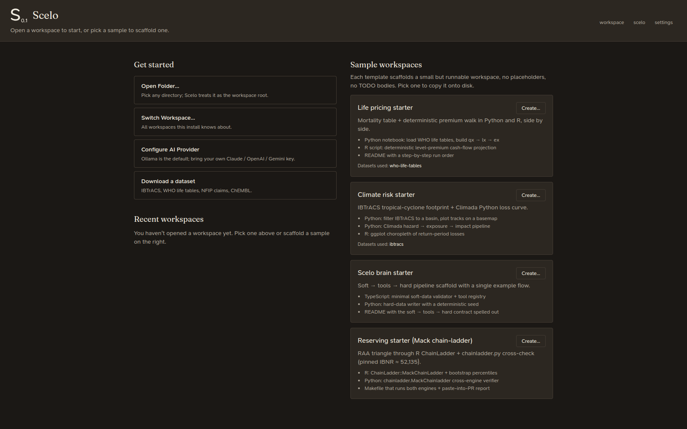

# First launch

{ .shadow }

## The runtime check

On the very first launch, Scelo opens the **runtime check** — a report on the
bundled stack it just installed:

- **Python** — the portable interpreter version and that it can import the IA
  package set (numpy, pandas, lifelib, chainladder, climada, …).
- **R** — the portable R version and that the actuarial libraries
  (ChainLadder, chainladder, lifecontingencies, forecast, …) load.
- **Status per component** — green when ready; a clear message if something
  didn't stage.

You can re-open this any time at the `/runtime-check` route. If a component
shows an error, see [Troubleshooting](../reference/troubleshooting.md).

## The welcome screen

After the runtime check, every launch lands on the **welcome** screen, where you
choose where to work:

- **Open Folder…** — point Scelo at any directory; it becomes the workspace
  root.
- **Switch Workspace…** — jump between workspaces Scelo knows about.
- **Configure AI Provider** — Ollama is the local default (no key, no spend);
  switch to a hosted provider here. See [AI providers](../ai-providers.md).
- **Download a dataset** — grab a starter dataset (IBTrACS cyclones, WHO life
  tables, NFIP claims, ChEMBL, …).
- **Sample workspaces** — one-click scaffolds you can copy to disk to learn the
  flow:
    - *Life pricing starter* — mortality table + deterministic premium walk
      in Python and R.
    - *Climate risk starter* — IBTrACS + Climada loss curve.
    - *Scelo brain starter* — a minimal soft → tools → hard pipeline.
    - *Reserving starter (Mack chain-ladder)* — RAA triangle through R
      ChainLadder + chainladder.py, cross-checked.

## Where to next

- New to the flow? → [Getting started](../getting-started.md)
- Want the code editor / terminal? → [The workspace](../workspace/index.md)
- Straight to the analysis? → [The pipeline](../pipeline/index.md)
