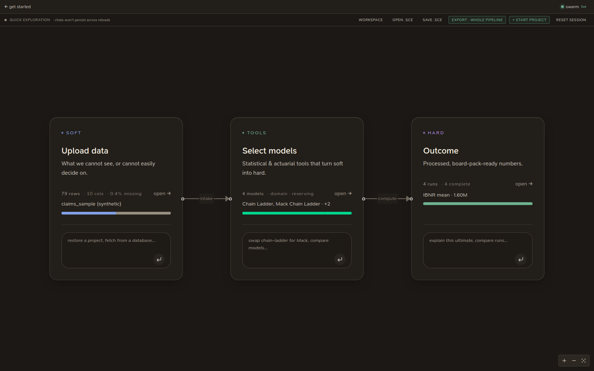
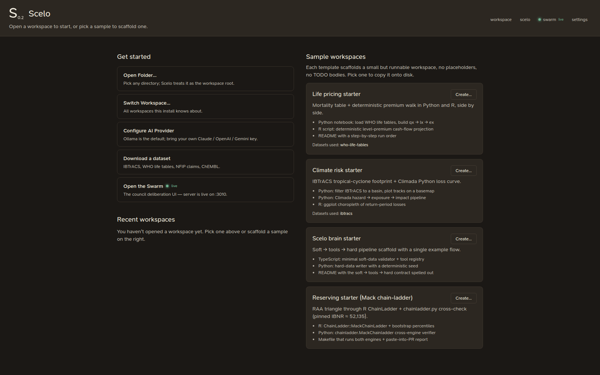

# First launch

{ .shadow }

## The pipeline, straight away

Every launch plays a short intro, the S₀.₂ mark drawing itself in, and opens on
the **Scelo pipeline**: the macro view of the three stages, Soft → Tools → Hard
(see [The pipeline](../pipeline/index.md)). **get started**, top left, takes
you to the welcome screen. The bar above the pipeline carries:

- **workspace** — the files, editor and terminal (see
  [The workspace](../workspace/index.md)). With no workspace open yet, it takes
  you to the welcome screen to pick one.
- **open .sce / save .sce** — the whole session as a project file.
- **export · whole pipeline**.
- **+ start project** — name the session so its chats persist.
- **reset session** — wipe the dataset, model picks, runs and activity log. It
  asks first.

A click or a key skips the intro; with reduced motion on, the mark simply
appears.

## The runtime check

The **runtime check** reports on the bundled stack:

- **Python** — the portable interpreter version and that it can import the IA
  package set (numpy, pandas, lifelib, chainladder, climada, …).
- **R** — the portable R version and that the actuarial libraries
  (ChainLadder, chainladder, lifecontingencies, forecast, …) load.
- **Status per component** — green when ready; a clear message if something
  didn't stage.

Open it any time with **Navigate: Runtime Check** in the command palette, or at
the `/runtime-check` route. If a component shows an error, see
[Troubleshooting](../reference/troubleshooting.md).

## The welcome screen

{ .shadow }

The **welcome** screen is where you choose where to work. **get started**, top
left of the pipeline, always opens it; **workspace** takes you there while no
workspace is open, and the workspace header links back to it:

- **Open Folder…** — point Scelo at any directory; it becomes the workspace
  root.
- **Switch Workspace…** — jump between workspaces Scelo knows about.
- **Configure AI Provider** — Ollama is the local default (no key, no spend);
  switch to a hosted provider here. See [AI providers](../ai-providers.md).
- **Download a dataset** — grab a starter dataset (IBTrACS cyclones, WHO life
  tables, NFIP claims, ChEMBL, …).
- **Sample workspaces** — one-click scaffolds you can copy to disk to learn the
  flow:
    - *Life pricing starter* — mortality table + deterministic premium walk
      in Python and R.
    - *Climate risk starter* — IBTrACS + Climada loss curve.
    - *Scelo brain starter* — a minimal soft → tools → hard pipeline.
    - *Reserving starter (Mack chain-ladder)* — RAA triangle through R
      ChainLadder + chainladder.py, cross-checked.

## Where to next

- New to the flow? → [Getting started](../getting-started.md)
- Want the code editor / terminal? → [The workspace](../workspace/index.md)
- Straight to the analysis? → [The pipeline](../pipeline/index.md)
