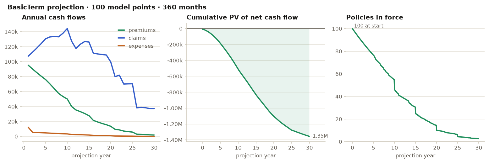
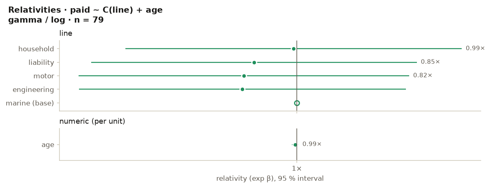

# Charts

Eight chart functions that know what an actuarial figure should look
like, on one colour-vision-validated palette. In Python they draw with
matplotlib (`pip install "scelo[viz]"`) and return the figure — no
pyplot state, so a notebook shows it once and a script calls
`fig.savefig(...)`. In R they draw with base graphics on the current
device and return their data invisibly.

=== "Python"

    ```python
    sc.plot_projection(sc.basicterm(mp))            # cash flows · cumulative PV · in force
    sc.plot_relativities(m)                         # forest plot of a GLM's relativities
    sc.plot_triangle(tri)                           # development curves, oldest light → latest dark
    sc.plot_rates(df, "province", "lapsed", exposure="exposure")   # rate by group, 95 % CI
    sc.plot_scr(scr)                                # the SCR build-up with diversification
    sc.plot_csm(ifrs)                               # CSM closing balance and yearly release
    sc.plot_bars(series)                            # one-series bars, values at the tips
    sc.plot_lines(df, "year", ["actual", "expected"])   # up to five series — then it refuses
    sc.save_figure(fig, "projection.png")
    ```

=== "R"

    ```r
    sc_plot_projection(sc_basicterm(mp))
    sc_plot_relativities(m)
    sc_plot_triangle(tri)
    sc_plot_rates(df, "province", "lapsed", exposure = "exposure")
    sc_plot_scr(scr)
    sc_plot_csm(ifrs)
    sc_plot_bars(x)
    sc_plot_lines(df, "year", c("actual", "expected"))
    ```

A real `plot_projection(sc.basicterm(sc.sample("lifelib-mp")))`:

{ .shadow }

and `plot_relativities` on the claims-sample GLM from the
[pricing chapter](pricing-fairness.md):

{ .shadow }

## The house style, enforced

The functions carry the lab's chart rules so you do not have to remember
them:

- **One hue for one series.** Magnitude charts use a single green;
  comparisons use up to five validated series colours — and only the
  first three pass every pairwise colour-vision check, which is why
  `plot_lines` takes at most five series and refuses more instead of
  drawing an unreadable rainbow.
- **Ordinal data gets an ordinal ramp.** `plot_triangle` draws origins
  oldest-light to latest-dark and labels the first and last.
- **Uncertainty is drawn, not implied.** `plot_rates` puts a 95 %
  Poisson interval on every bar and an overall-rate reference line;
  `plot_relativities` puts the interval on every dot and marks the base
  level hollow at 1.
- **The numbers are on the chart.** Bars are labelled at the tips (up to
  30), the projection marks its break-even, the SCR chart labels its
  diversification credit.

`sc.palette()` / `sc_palette()` return the tokens — surface, inks,
grid, the five series colours, a five-step sequential ramp and a
diverging triple — for figures of your own that need to sit beside these.
