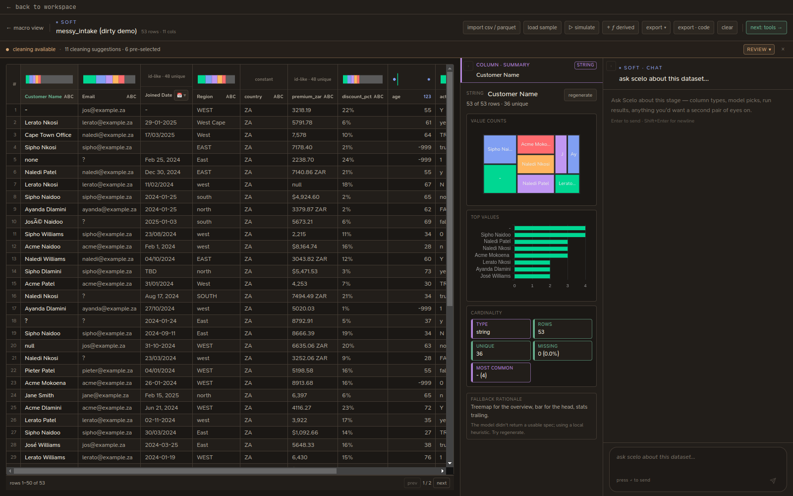

# Soft Data

The intake desk. Load a dataset, understand it, and get it clean and shaped
before it goes to the models. Layout is cribbed from a data-wrangler: a columns
list on the left, the grid in the middle, a column summary on the right, and a
scoped chatbot across the bottom.

{ .shadow }

## Loading data

| Action | What it does |
| --- | --- |
| **import csv / parquet** | Load your own file from disk |
| **load sample** | Load a built-in messy sample dataset to explore the tools |
| **clear** | Drop the current dataset |

The sample is a realistic mess on purpose: currency strings, %-suffixed numbers,
sentinel ages (-999 / 9999), mixed Y/N booleans, mixed date formats, case-only
duplicates, mojibake, BOM/NBSP characters, missing markers, and duplicate rows —
so every cleaning tool has something to do.

## The grid

Each column header shows:

- A **type badge** — `abc` (text), `123` (numeric), `📅` (date).
- A **mini distribution** (histogram or category bar).
- **rows · cols · % missing** for the dataset.

Click a column to **select** it; its full summary appears on the right
(type, missing, unique, top values, five-number summary, histogram).

## Cleaning

When Scelo detects issues, a **cleaning banner** appears above the grid. It lists
each suggested operation with a count of affected cells and a *safe* flag. Tick
the ones you want and **Apply**.

The full op set:

| Op | What it fixes |
| --- | --- |
| trim whitespace | leading/trailing spaces |
| collapse internal whitespace | runs of spaces/tabs/newlines |
| fix encoding artefacts | mojibake, BOM, NBSP, zero-width chars |
| normalise missing markers | `N/A`, `?`, `-`, `TBD`, … → null |
| parse numeric strings | `$1,234` / `(1,234)` / `85%` → numbers |
| parse date strings | date-shaped text → ISO `YYYY-MM-DD` |
| standardise booleans | mixed yes/no/Y/N → `true`/`false` |
| replace sentinel numerics | repeated `-999` / `9999` codes → null |
| merge case-only duplicates | `WEST`/`west`/`West` → one bucket |
| rename to snake_case | headers with spaces/dots/mixed case |
| drop near-empty columns | columns >95% missing |
| drop constant columns | columns with a single value |
| drop duplicate rows | exact-match duplicates |

!!! tip "Or just ask"
    Type **`clean my data`** in the soft-data chat and Scelo runs the
    recommended set for you — no backend needed, fully local.

## Date formatting

Scelo reads date columns intelligently, including **day-first (European)**
formats that the naive date parser would reject. Two ways to reformat:

- **Click:** on a date column, the type badge becomes a **📅 ▾** dropdown —
  pick **American (MM/DD/YYYY)**, **European (DD/MM/YYYY)**, or **ISO 8601**.
- **Chat:** `make the dates american format`, `format the dataset european`,
  or hover a single column's chat and say `make this ISO`.

It infers each column's source convention (so `29-01-2025` is read as day-first)
and reports if any cells weren't recognisable dates.

## Per-column actions (chat)

Hover any column header to open its scoped chat:

- `make this american` — reformat just this column's dates.
- `remove all non-dates` — null every cell in a date column that isn't a date.
- `clean this column` — trim, fix encoding, collapse whitespace, and null
  missing-markers for that column only.

## Data augmentation

Generate synthetic rows from the soft-data chat:

```
add 1000 more rows through augmentation
```

Scelo bootstrap-resamples real rows (preserving correlations) and adds light
Gaussian jitter to numeric columns. Categoricals, dates, and identifier columns
are preserved. Use it for stress-testing intake; for correlation-preserving
synthesis (SMOTE, copulas, CTGAN), move to the modeling stage.

## Derived columns and filters

- **+ ƒ derived** — add a column from a formula (`df.eval`-style expressions).
- Click a column's distribution to add a **filter**; active filters show as
  chips above the grid and can be cleared individually or all at once.

## Simulating and exporting

- **▷ simulate** — generate a synthetic dataset by simulating a population's
  response to a scenario (via the swarm). See [The swarm](../swarm/index.md).
- **export ▾** — export the cleaned dataset (CSV / Parquet).
- **export · code** — export everything you did as a runnable Python / R / C++
  script. See [Exporting](../exporting.md).

When you're ready: **next: tools →**.
