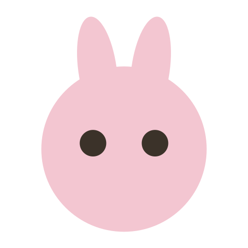

# The swarm

The swarm is a **multi-agent nanoeconomics engine** embedded in Scelo. It does
two things:

- **Convenes a council** of simulated professional agents to deliberate over a
  forecast — surfacing consensus, dissent, and reasoning (it does not decide; it
  surfaces inputs so *you* can). The forecast models a community; when the
  scenario isn't one (a fund's allocation, a reserving estimate, a model result
  sent from Scelo), the council judges the scenario as stated instead.
- **Simulates a population's** response to a medical or social shock, scaling
  micro outcomes up to macro impact (workdays lost, GDP drag, mortality, cost).

You reach it two ways:

- From **Hard Data → Convene council → Open in swarm** (the pipeline route).
- Directly from the **swarm** view in the workspace.

The swarm: the pet rail — one animal per surface — beside the council, with eight professional agents landing a stance over three rounds. The animated illustration needs JavaScript.

## The surfaces — and their pets

Navigation is the **pet rail** down the left edge: six animals, one per
surface, and the animal is the only thing that identifies it. The active
pet grows a step and wears its name in its own colour; the others step
back to icons. The cat sits slightly apart — the Canon is the corpus the
other surfaces read from, not another view of the run.

| Pet | Surface | What it shows |
| --- | --- | --- |
| { .pet-inline } bunny | **Forecast** | The WMTR survival projection: wealth trajectory, survival curve, outcome distribution, M/T/R components (or, for a scenario that isn't a community, why there is none, above the council's verdict) |
| { .pet-inline } dog | **Council Reactions** | The deliberation graph + a readback Sankey (profession → trust the forecast, or the scenario? → confidence) |
| { .pet-inline } hamster | **Society Pulse** | How a broader simulated society reacts |
| { .pet-inline } turtle | **Readback** | The synthesised narrative of the council |
| { .pet-inline } chick | **Simulation** | Population simulation of a scenario → macro impact |
| { .pet-inline } cat | **Canon** | The reference works injected into every agent's prompt |

The pets are alive. Each one breathes, sways and blinks — with the odd double
blink and, rarely, a wink — and its eyes follow your cursor, but only so far:
a pet glances at the pointer rather than staring it down. Hover a pet and it
leans in, curious; the chosen one is happy, and hops when you pick it. The
bunny that greets you on an empty swarm follows the cursor too, and twirls if
you click it. If your system asks for reduced motion, the pets hold still.

## It runs as its own server — started for you

The swarm is a self-contained app (`apps/swarm` in the Scelo repo) with its own
server. Scelo IDE **bundles it and starts it with the app** on a loopback port,
and stops it on quit — nothing to launch by hand. See
[Running the swarm](running.md) for where it lives, its data and log, and the
checkout (dev) mode.

Inside Scelo IDE the swarm wears the IDE's theme, so a dark IDE frames a dark
swarm. The theme button in the swarm's own header decides: **auto**, the
default, follows the IDE, while **light** or **dark** pins that theme.

!!! tip
    The swarm is a decision-*support* cockpit. The agents report; the actuary
    decides.
