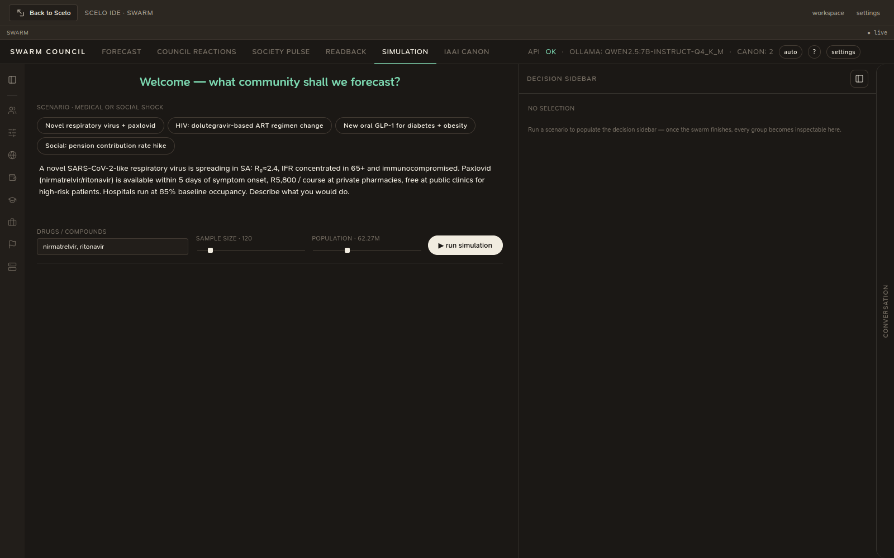
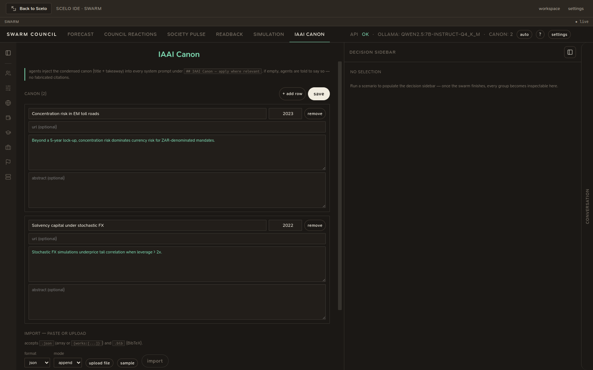

# Council, society & simulation

A tour of what each swarm tab does.

## Forecast

The WMTR (Wealth = Material × Time × Relational) survival projection under
shocks, shown as four panels: wealth trajectory (25–75 band + mean), survival
probability S(t), the outcome distribution, and the M/T/R components.

From here you can **Forecast & convene** to run a council on the projection.

## Council reactions

The heart of the deliberation:

- A **force graph** of agents (Finance, Investor, Accountant, Actuary,
  Psychologist, Lawyer, …), coloured and bordered by their final stance.
- A **readback Sankey**: profession → *trust the forecast?* → confidence band.
- A **decision sidebar** — click an agent to see its per-round reasoning,
  key risk, and final vote; click a profession to see the group's aggregate.

### Recommended interventions

When an agent recommends changing a model parameter, it's shown as a tidy card
(e.g. **↑ αM · large** with a one-line rationale), not raw JSON. On
the strip you can **apply & re-simulate** a consensus intervention to see how
the forecast shifts.

## Society pulse

A broader simulated society's reaction to the same scenario, with configurable
society parameters (income mix, education mix, employment mix, culture).

## Simulation

{ .shadow }

A standalone population simulator:

1. Pick a **scenario** (a medical or social shock) — or paste your own.
2. Set the **drugs / compounds**, **sample size**, and **population**.
3. **Run simulation**. A progress panel shows the pipeline
   (references → sample → simulate → macro impact).
4. Results: **macro impact** tiles (workdays lost, GDP drag, excess mortality,
   hospital admissions/cost, insurer claims, out-of-pocket), treatment-uptake
   bars, and distributional tables by age and comorbidity.

Drug references are resolved live via PubChem, OpenFDA, and ChEMBL.

## IAAI Canon

{ .shadow }

The reference works (title + takeaway) that get injected into every agent's
system prompt under "IAAI Canon — apply where relevant". Add, edit, or import
works (JSON or BibTeX). If empty, agents are told to say so — no fabricated
citations.

!!! note "State persists across tabs"
    Switching tabs keeps your scenario, slider values, and results — you resume
    exactly where you left off.
